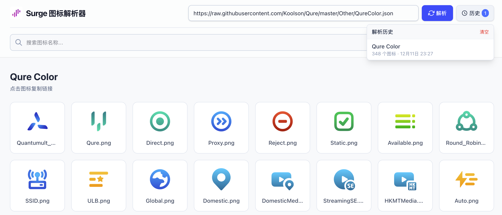

# Geosite

This repository clones [v2fly/domain-list-community](https://github.com/v2fly/domain-list-community) and generates a list of optional items for `geosite`.

## Icon Browser

[Icon Browser](https://icon-browser-one.vercel.app/) is an online tool for parsing and browsing Surge-style icon sets.

## Geosite List

You can view the complete list of available geosite entries in [geosite-list.md](geosite-list.md). This file is automatically generated and updated daily.

